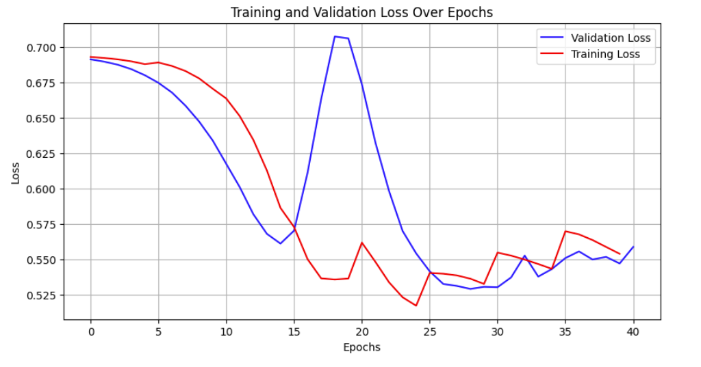

# Spotify_GCN

The increasing demand for personalized music experiences has led to the development of ad-
vanced recommendation systems. This project focuses on designing a Spotify Songs Recommenda-
tion System leveraging Graph Neural Networks (GNNs), including LightGCN and SAGEConv, to
predict playlist-track relationships effectively. By utilizing the Spotify Million Playlist Dataset, we
represent user-song interactions as a bipartite graph, applying K-core analysis to reduce compu-
tational complexity while preserving critical structural information. The system optimizes recom-
mendations using Bayesian Personalized Ranking (BPR) Loss, ensuring precise ranking of relevant
tracks. Our approach balances efficiency and representation richness, with LightGCN providing
scalability for large datasets and SAGEConv enabling nuanced neighborhood aggregations. The
evaluation metrics, Recall@K and ROC-AUC, demonstrate the effectiveness of the proposed mod-
els, with SAGEConv outperforming LightGCN in capturing user preferences.

## The Models that we used for our project were: 
1. LightGCN

2. SageCONV

Here were our results: 
1. ROC_AUC
   

2. Training Loss
 

3. Recall @ K vs K

4. Recall by Number of Epochs
   

